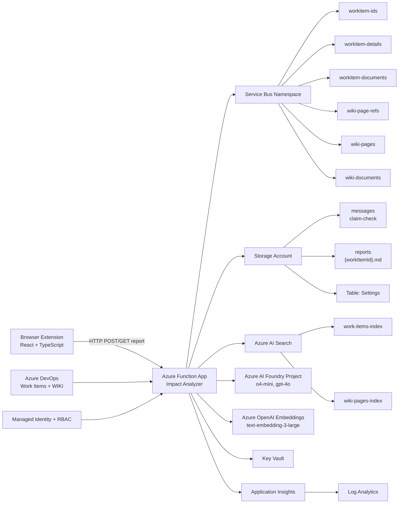
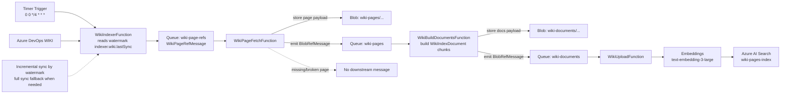
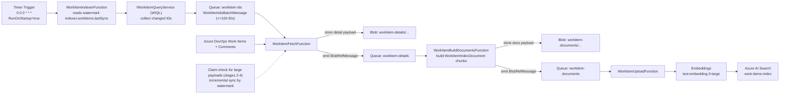

## Azure components

```mermaid
flowchart LR
  EXT["Browser Extension<br/>React + TypeScript"] -->|HTTP POST/GET report| APP["Azure Function App<br/>Impact Analyzer"]

  ADO["Azure DevOps<br/>Work Items + WIKI"] --> APP

  APP --> SB["Service Bus Namespace"]
  SB --> Q1["workitem-ids"]
  SB --> Q2["workitem-details"]
  SB --> Q3["workitem-documents"]
  SB --> Q4["wiki-page-refs"]
  SB --> Q5["wiki-pages"]
  SB --> Q6["wiki-documents"]

  APP --> ST["Storage Account"]
  ST --> MSG["messages<br/>claim-check"]
  ST --> REP["reports<br/>{workItemId}.md"]
  ST --> TAB["Table: Settings"]

  APP --> SRCH["Azure AI Search"]
  SRCH --> IDX1["work-items-index"]
  SRCH --> IDX2["wiki-pages-index"]

  APP --> FDRY["Azure AI Foundry Project<br/>o4-mini, gpt-4o"]
  APP --> EMB["Azure OpenAI Embeddings<br/>text-embedding-3-large"]

  APP --> KV["Key Vault"]
  APP --> AI["Application Insights"]
  AI --> LAW["Log Analytics"]

  MI["Managed Identity + RBAC"] --> APP
```

## WIKI vectorization

```mermaid
flowchart LR
  TMR["Timer Trigger<br/>0 0 */4 * * *"] --> IDX["WikiIndexerFunction<br/>reads watermark indexer.wiki.lastSync"]
  ADO["Azure DevOps WIKI"] --> IDX
  IDX --> QREF["Queue: wiki-page-refs<br/>WikiPageRefMessage"]

  QREF --> FETCH["WikiPageFetchFunction"]
  FETCH -->|store page payload| BLOB1["Blob: wiki-pages/..."]
  FETCH -->|emit BlobRefMessage| QPAGES["Queue: wiki-pages"]
  FETCH -. missing/broken page .-> SKIP["No downstream message"]

  QPAGES --> BUILD["WikiBuildDocumentsFunction<br/>build WikiIndexDocument chunks"]
  BUILD -->|store docs payload| BLOB2["Blob: wiki-documents/..."]
  BUILD -->|emit BlobRefMessage| QDOCS["Queue: wiki-documents"]

  QDOCS --> UP["WikiUploadFunction"]
  UP --> EMB["Embeddings<br/>text-embedding-3-large"]
  EMB --> SRCH["Azure AI Search<br/>wiki-pages-index"]

  NOTE["Incremental sync by watermark<br/>full sync fallback when needed"] -.-> IDX
```

## Work Items vectorization

```mermaid
flowchart LR
  TMR["Timer Trigger<br/>0 0 0 * * *<br/>RunOnStartup=true"] --> IDX["WorkItemIndexerFunction<br/>reads watermark indexer.workitems.lastSync"]
  IDX --> WIQL["IWorkItemQueryService (WIQL)<br/>collect changed IDs"]
  WIQL --> QIDS["Queue: workitem-ids<br/>WorkItemIdsBatchMessage (<=100 IDs)"]

  QIDS --> FETCH["WorkItemFetchFunction"]
  ADO["Azure DevOps Work Items + Comments"] --> FETCH
  FETCH -->|store detail payload| BLOB1["Blob: workitem-details/..."]
  FETCH -->|emit BlobRefMessage| QDETAILS["Queue: workitem-details"]

  QDETAILS --> BUILD["WorkItemBuildDocumentsFunction<br/>build WorkItemIndexDocument chunks"]
  BUILD -->|store docs payload| BLOB2["Blob: workitem-documents/..."]
  BUILD -->|emit BlobRefMessage| QDOCS["Queue: workitem-documents"]

  QDOCS --> UP["WorkItemUploadFunction"]
  UP --> EMB["Embeddings<br/>text-embedding-3-large"]
  EMB --> SRCH["Azure AI Search<br/>work-items-index"]

  NOTE["Claim-check for large payloads (stages 2-4)<br/>incremental sync by watermark"] -.-> FETCH
```