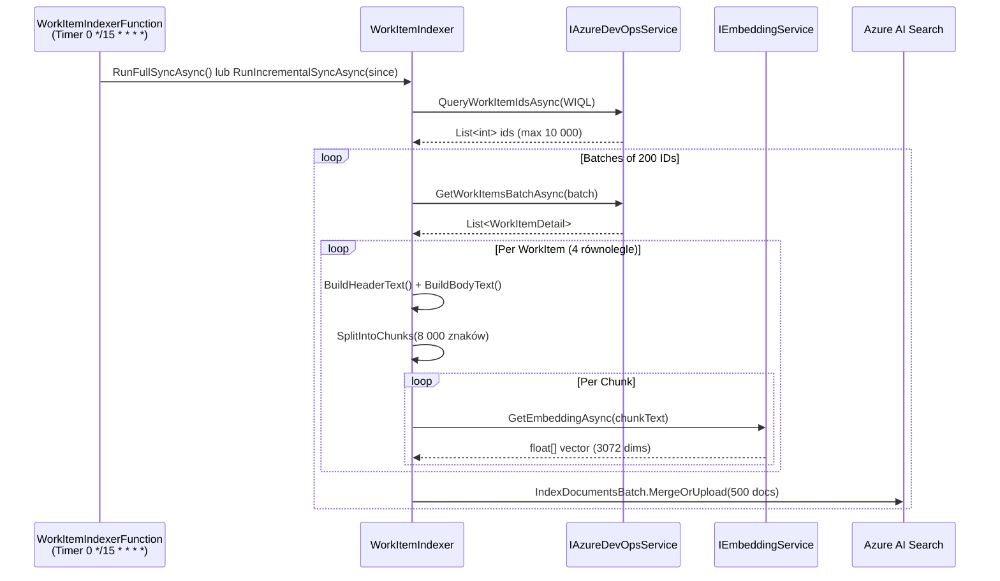

```mermaid
sequenceDiagram
    participant F as WorkItemIndexerFunction<br/>(Timer 0 */15 * * * *)
    participant I as WorkItemIndexer
    participant D as IAzureDevOpsService
    participant E as IEmbeddingService
    participant S as Azure AI Search

    F->>I: RunFullSyncAsync() lub RunIncrementalSyncAsync(since)
    I->>D: QueryWorkItemIdsAsync(WIQL)
    D-->>I: List#lt;int#gt; ids (max 10 000)
    loop Batches of 200 IDs
        I->>D: GetWorkItemsBatchAsync(batch)
        D-->>I: List#lt;WorkItemDetail#gt;
        loop Per WorkItem (4 równolegle)
            I->>I: BuildHeaderText() + BuildBodyText()
            I->>I: SplitIntoChunks(8 000 znaków)
            loop Per Chunk
                I->>E: GetEmbeddingAsync(chunkText)
                E-->>I: float[] vector (3072 dims)
            end
        end
        I->>S: IndexDocumentsBatch.MergeOrUpload(500 docs)
    end
```